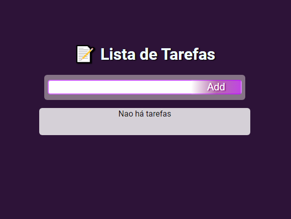
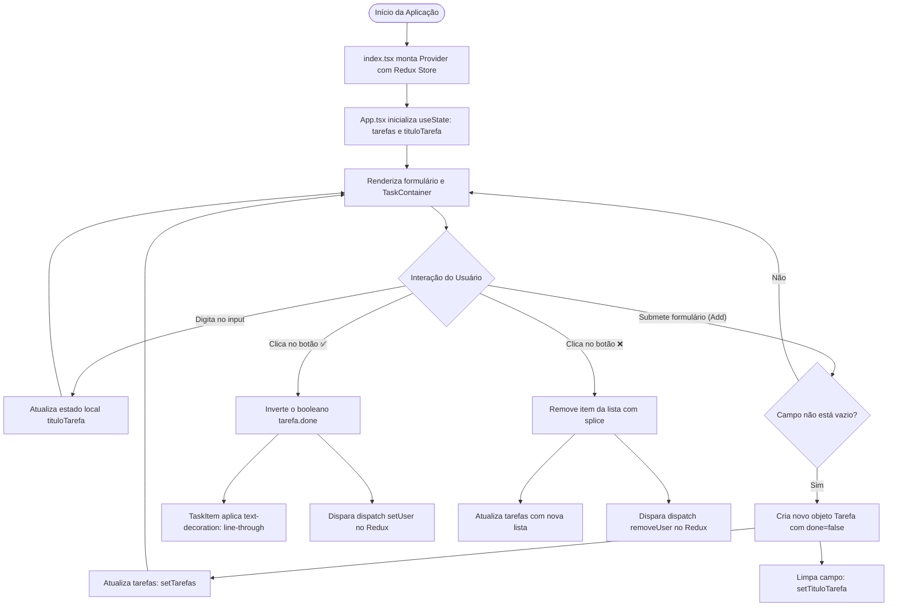
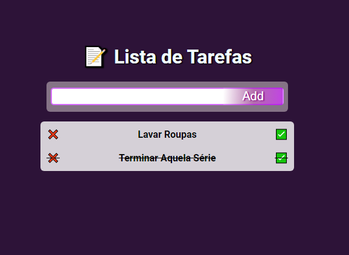

# 📋 Lista de Tarefas — React, TypeScript, Styled-Components & Redux

<br />

<div align="center">
  
</div>

<br />

<div align="center">

[](https://lista-tarefas-22ym.vercel.app/)
[](https://react.dev/)
[](https://www.typescriptlang.org/)
[](https://styled-components.com/)
[](https://redux-toolkit.js.org/)
[](LICENSE)
[](#)

</div>

---

## 🔗 Demonstração ao Vivo (Deploy)

A aplicação está disponível e pronta para uso através do deploy na **Vercel**:

👉 **[Acesse a Lista de Tarefas Online](https://lista-tarefas-22ym.vercel.app/)**

---

## 📖 Visão Geral

A **Lista de Tarefas** é uma aplicação web interativa desenvolvida com o objetivo de explorar os recursos mais modernos do ecossistema front-end em **React com TypeScript**, combinando a arquitetura de estilização declarativa com **Styled-Components (CSS-in-JS)** e o gerenciamento de estado previsível com **Redux Toolkit**.

A aplicação permite criar afazeres de forma rápida, marcar tarefas concluídas com alternância dinâmica de estilo visual (efeito de texto riscado *line-through*), excluir itens da lista e disparar eventos associados no estado global gerenciado via Redux.

O projeto une rigor de tipagem estática em tempo de desenvolvimento a uma interface visual temática com paleta roxa neon (*Neon Purple / Dark Gradient*), garantindo alto contraste, legibilidade e fluidez na interação do usuário.

---

## ✨ Funcionalidades

* **Criação de Tarefas:** Campo de entrada com validação que impede afazeres em branco, adicionando itens à lista através do clique no botão estilizado ou tecla `Enter`.
* **Marcação de Conclusão com Alternância (Toggle):** Clique no seletor de confirmação (`✅`) para alternar o status da tarefa entre pendente e concluída, acionando em tempo real o estilo de tachado (`text-decoration: line-through`).
* **Exclusão de Tarefas:** Remoção definitiva do item da coleção ao clicar no seletor de cancelamento (`❌`).
* **Feedback de Coleção Vazia:** Exibição da mensagem amigável *"Não há tarefas"* sempre que a lista estiver sem pendências cadastradas.
* **Integração com Redux Toolkit:** Disparo de ações globais (`setUser` e `removeUser`) na conclusão e exclusão de afazeres, exercitando o fluxo de despacho (`useDispatch`) e mutação imutável com slices do Redux.
* **Componentização Modular e Tipada:** Separação anatômica entre o contêiner de itens (`TaskContainer`), o item de tarefa (`TaskItem`) e o botão reutilizável (`Botao`).

---

## 🎯 Diferenciais e Destaques Técnicos

1. **Tipagem Estrita com TypeScript:** Todas as propriedades de componentes, manipuladores de eventos (`React.FormEvent`), estados e payloads do Redux são expressos através de contratos e interfaces dedicadas (`Tarefa`, `BotaoProps`, `BotaoDefaultProps`, `CoresBotao`, `TaskItemProps`, `TaskContainerProps`, `UserState`).
2. **CSS-in-JS com Styled-Components:**
   * Estilização encapsulada por componente sem vazamento de escopo global.
   * Interpolação dinâmica de propriedades: o componente `BotaoDefault` aceita a prop `cor` (`default`, `alert`, `danger`) mapeando o esquema cromático em tempo de renderização.
   * Modificação condicional de estilos no `TaskItem` através do utilitário `css` do Styled-Components (`props.done ? css'text-decoration: line-through;' : ''`).
3. **Gerenciamento de Estado Global com Redux Toolkit:**
   * Configuração do store central através do `configureStore` com inferência de tipo `RootStore = ReturnType<typeof store.getState>`.
   * Implementação de fatia de estado (*slice*) com `createSlice` em `store/modules/user`, garantindo imutabilidade facilitada pelo motor interno Immer.
4. **Imutabilidade e Cópia Defensiva:** Manipulação cuidadosa do estado local (`setTarefas([...novaLista])`) prevenindo mutações diretas por referência de memória em arrays JavaScript.
5. **Paleta Visual com Gradientes Modernos:** Fundo escuro em tons de púrpura (`rgba(40, 13, 51, 0.973)`), botões com gradientes lineares de 273 graus e sombras com brilho suave (*text-shadow* roxo).

---

## 🏗️ Arquitetura e Estrutura de Pastas

```bash
lista-tarefas/
├── .gitignore                                 # Regras de exclusão do Git (node_modules, build, etc.)
├── package.json                               # Dependências, tipos e scripts do npm
├── package-lock.json                          # Versões estritas e árvore de pacotes resolvida
├── README.md                                  # Documentação técnica do projeto
├── tsconfig.json                              # Configurações do compilador TypeScript (ESNext, JSX)
├── public/
│   ├── favicon.ico                            # Ícone da aplicação
│   ├── index.html                             # Documento HTML base com a div raiz #root
│   ├── manifest.json                          # Metadados de PWA (Web App Manifest)
│   └── robots.txt                             # Diretivas para rastreadores de busca
├── screenshots/
│   ├── 1664039715917.png                      # Evidência visual da lista vazia
│   └── 1664039736264.png                      # Evidência visual de tarefas cadastradas e concluídas
└── src/
    ├── App.tsx                                # Componente central com formulário, estado e lógica
    ├── index.tsx                              # Ponto de montagem com Provider do Redux e React 18
    ├── react-app-env.d.ts                     # Declarações de ambiente do Create React App
    ├── components/
    │   ├── Botao/
    │   │   ├── index.tsx                      # Componente Botao tipado com BotaoProps
    │   │   └── styles.ts                      # BotaoDefault estilizado com gradientes e prop de cor
    │   ├── TaskContainer/
    │   │   └── index.tsx                      # Contêiner não ordenado ul para listagem
    │   └── TaskItem/
    │       ├── index.tsx                      # Componente individual da tarefa com seletores
    │       └── styles.ts                      # Item styled.li com efeito condicional de risco
    ├── store/
    │   ├── index.ts                           # Configuração do Redux Store central
    │   └── modules/
    │       └── user/
    │           └── index.ts                   # Slice do usuário com reducers setUser e removeUser
    └── styles/
        └── style.css                          # Estilos globais e importação da tipografia Roboto
```

---

## 🔄 Fluxo de Estado e Arquitetura

O diagrama abaixo ilustra a integração entre o estado local do React e o Store global do Redux Toolkit:



---

## 🎨 UX, Estilização e Design System

* **Tipografia:** Google Font **Roboto** (pesos 100 a 900) aplicada globalmente com resets de margem e preenchimento.
* **Esquema de Cores:**
  * Fundo da Aplicação: `rgba(40, 13, 51, 0.973)` (Roxo berinjela escuro profundo).
  * Contêiner do Formulário: `rgba(221, 211, 211, 0.5)` com cantos arredondados (`border-radius: 6px`).
  * Contêiner da Lista: `rgba(255, 255, 255, 0.8)` para legibilidade e contraste absoluto com os textos escuros.
  * Botão de Adição: Gradiente linear em degradê de magenta/púrpura (`rgba(193, 68, 227, 1)`) com borda em roxo neon.
  * Título: Azul gelo (`azure`) com sombra de relevo preta (`text-shadow: 2px 1px 2px black`).

---

## 📸 Telas da Aplicação

<details open>
<summary><b>📂 Visualizar Telas em Execução</b></summary>

<br />

| Estado Inicial / Lista Vazia | Tarefas em Andamento e Concluídas |
| :---: | :---: |
|  |  |

</details>

---

## 📖 Passo a Passo de Uso

1. **Acessar a Aplicação:** Abra o [Link de Demonstração na Vercel](https://lista-tarefas-22ym.vercel.app/) ou execute localmente no navegador.
2. **Cadastrar Tarefa:** Digite o nome da atividade no campo de texto e clique no botão **Add** (ou aperte Enter).
3. **Marcar Concluída:** Ao finalizar a atividade, clique no botão de verificação verde (**✅**); a tarefa ficará riscada no meio, indicando o cumprimento da meta.
4. **Excluir Tarefa:** Para remover um afazer, clique no ícone de cancelamento vermelho (**❌**).

---

## 🎓 Objetivo do Projeto

Construído para consolidar habilidades essenciais na trilha de especialização em front-end:
* Criação de projetos React com configuração estrita de **TypeScript**.
* Criação de sistemas de design flexíveis e manuteníveis utilizando **Styled-Components**.
* Arquitetura de dados globais escalável através de **Redux Toolkit**.

---

## ⚙️ Requisitos e Instalação

### Pré-requisitos
* [Node.js](https://nodejs.org/) versão 18 LTS ou 20 LTS.
* Gerenciador de pacotes `npm` ou `yarn`.
* [Git](https://git-scm.com/) instalado.

### Instalação

1. Clone o repositório em sua máquina:
```bash
git clone https://github.com/erickystn/lista-tarefas.git
```

2. Acesse a pasta do projeto:
```bash
cd lista-tarefas
```

3. Instale as dependências:
```bash
npm install
```

---

## 🚀 Como Executar

### 1. Ambiente de Desenvolvimento
Inicia a aplicação localmente com hot-reload ativo:
```bash
npm start
```
Abra o navegador em `http://localhost:3000`.

### 2. Build de Produção
Gera os arquivos otimizados e minificados na pasta `build/`:
```bash
npm run build
```

---

## 💻 Exemplos de Código

### 1. Componente de Item Estilizado com Styled-Components (`src/components/TaskItem/styles.ts`)
```typescript
import styled, { css } from "styled-components";

interface ItemProps {
  done: boolean;
}

export const Item = styled.li<ItemProps>`
  display: flex;
  line-height: 7px;
  align-items: center;
  justify-content: space-between;
  font-weight: bold;

  &:hover span {
    cursor: pointer;
  }

  ${(props) => props.done ? css`text-decoration: line-through;` : ""}
`;
```

---

### 2. Configuração do Redux Slice (`src/store/modules/user/index.ts`)
```typescript
import { createSlice } from "@reduxjs/toolkit";

interface UserState {
  token?: string;
  email?: string;
  isLogged: boolean;
}

const userReduce = createSlice({
  name: "user",
  initialState: {
    isLogged: false,
  } as UserState,
  reducers: {
    setUser(state, action) {
      Object.assign(state, {
        token: action.payload.token,
        email: action.payload.email,
        isLogged: true,
      });
    },
    removeUser(state, action) {
      Object.assign(state, {
        token: undefined,
        email: undefined,
        isLogged: false,
      });
    },
  },
});

export const { setUser, removeUser } = userReduce.actions;
export default userReduce.reducer;
```

---

## 🧪 Suíte de Testes

O projeto inclui o ambiente de testes do **Jest** configurado em conjunto com a **React Testing Library**:

```bash
npm test
```

---

## 🛠️ Tecnologias Utilizadas

| Tecnologia | Versão | Papel na Aplicação |
| :--- | :--- | :--- |
| **[React](https://react.dev/)** | `18.2.0` | Biblioteca declarativa para criação da interface e gerenciamento do DOM virtual. |
| **[TypeScript](https://www.typescriptlang.org/)** | `4.7.4` | Superset de JavaScript com tipagem estática e segurança de tipos em tempo de compilação. |
| **[Styled-Components](https://styled-components.com/)** | `5.3.5` | Framework de CSS-in-JS para criação de componentes visuais estilizados e dinâmicos. |
| **[Redux Toolkit](https://redux-toolkit.js.org/)** | `1.8.5` | Ferramenta oficial para gerenciamento eficiente de estado global e fluxos de dados. |
| **[React Redux](https://react-redux.js.org/)** | `8.0.2` | Ligações oficiais do React para o store do Redux. |
| **[Vercel](https://vercel.com/)** | — | Plataforma de nuvem para hospedagem e entrega contínua da aplicação. |

---

## 📈 Melhorias e Próximos Passos (Roadmap)

- [ ] **Persistência em LocalStorage:** Sincronizar o array de tarefas com a Web Storage API para manter os dados salvos entre sessões.
- [ ] **Filtros de Estado:** Adicionar abas de navegação para visualizar *Todas*, *Apenas Concluídas* ou *Apenas Pendentes*.
- [ ] **Migração do Store de Tarefas para Redux:** Centralizar o array de tarefas no próprio Redux Toolkit através de um `tasksSlice` dedicado.
- [ ] **Edição de Texto:** Permitir a edição de tarefas existentes com duplo clique no título.
- [ ] **Contador de Progresso:** Barra de progresso visual exibindo a porcentagem de tarefas finalizadas.

---

## 🤝 Como Contribuir

1. Faça um **Fork** do repositório.
2. Crie uma branch com sua funcionalidade:
   ```bash
   git checkout -b feature/minha-feature
   ```
3. Commit suas alterações:
   ```bash
   git commit -m "feat: adiciona persistencia em LocalStorage para tarefas"
   ```
4. Envie as modificações para o seu fork:
   ```bash
   git push origin feature/minha-feature
   ```
5. Abra um **Pull Request** detalhando as melhorias.

---

## 👤 Autor & Créditos

* **Desenvolvedor:** [Ericky Sant'ana](https://github.com/erickystn)
* **Repositório do Projeto:** [GitHub @erickystn/lista-tarefas](https://github.com/erickystn/lista-tarefas)
* **Deploy Oficial:** [Vercel](https://lista-tarefas-22ym.vercel.app/)

---

## 📄 Licença

Este projeto está licenciado sob a licença **MIT**. Para maiores informações, consulte o arquivo de licença ou sinta-se livre para clonar, estudar e implementar novas melhorias.
